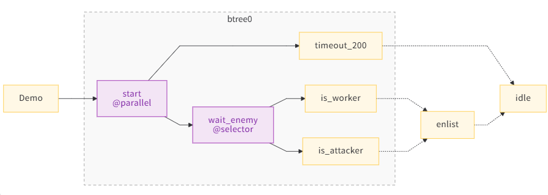

## 行为树

- [行为树](#行为树)
  - [行为节点](#行为节点)
  - [组合节点](#组合节点)

本节教程将介绍如何使用`行为机`的行为🌲部分。不过确切的说，您完全不必学习此章节，因为仅凭状态机也可以顺畅地游玩游戏。

### 行为节点

`CreepLogic`继承自`Stage`类，因此其具备`行为机`特性。其核心是状态节点，当每个状态节点都是一个方法，通过返回值来切换状态。 返回值类型决定执行方式：

* 返回下个状态的字符串来切换状态。
* 返回`行为结果`来切换到下一个行为状态。

| 行为结果      | 等同值     | 描述             |
|-----------|---------|----------------|
| `SUCCESS` | `True`  | 成功，切换到下一个行为状态  |
| `FAILURE` | `False` | 失败，回溯到上一个关键节点  |
| `RUNNING` | `None`  | 运行中，表示当前状态尚未结束 |

返回`SUCCESS`时，会切换到下一个行为状态。通过为该节点装饰`@behavior`，可以注册其为下一个节点；
如果返回`行为结果`的节点没有被装饰，那么会尝试回到栈上的上一个`组合节点`或者树的根节点，否则会产生一个警告，并且状态会一直保持。

```python
class Demo(Logic):
    NAME = "Demo"

    def start(self):
        return "run"

    @behavior("idle")
    def run(self):
        return SUCCESS

    def idle(self):
        return SUCCESS

```

<p align="center">

</p>

执行顺序: start -> (run -> idle) -> (run -> idle) - ...

**注意**: 如果在行为树中，某个节点返回了字符串，那么行为树上下文将会丢失。

### 组合节点

行为节点后可以紧跟一个组合节点(是的，只能跟在行为节点后面)。组合节点有3种类型:

| 组合节点        | 描述                                                 |
|-------------|----------------------------------------------------|
| `@sequence` | 顺序执行子节点，直到有一个子节点返回`FAILURE`，或者所有子节点都返回`SUCCESS`    |
| `@selector` | 顺序执行子节点，直到有一个子节点返回`SUCCESS`，或者所有子节点都返回`FAILURE`    |
| `@parallel` | 并行执行子节点，等价于 `selector`，但是返回`RUNNING`的子节点不会阻碍后续节点执行 |

```python
class Demo(Logic):
    """
    等待对方的首个有效单位。
    ①如果含WORK，响应一个攻击单位
    ②如果是攻击单位，响应2个攻击单位
    ③如果200tick都没有单位出现，切换到idle状态
    """
    NAME = "Demo"
    
    def onLoading(self):
        self.ec_trigger = Component(lambda :ESPAWN.creep).add(Trigger())
    
    @parallel("timeout_200", "wait_enemy")
    def start(self):
        return SUCCESS
    
    def timeout_200(self):
        if know.now >= 200: return "idle"
    
    @selector("is_worker", "is_attacker")
    def wait_enemy(self):
        return self.ec_trigger()

    def is_worker(self):
        if st.workable(ESPAWN.creep):
            self.enlist_count = 1
            return "enlist"
        return FAILURE

    def is_attacker(self):
        if st.atkable(ESPAWN.creep):
            self.enlist_count = 2
            return "enlist"
        return FAILURE

    def enlist(self):
        for i in range(self.enlist_count):
            Logic("Soldier", SPAWN)
        return "idle"
    
    def idle(self):
        pass
```

<p align="center">

</p>

